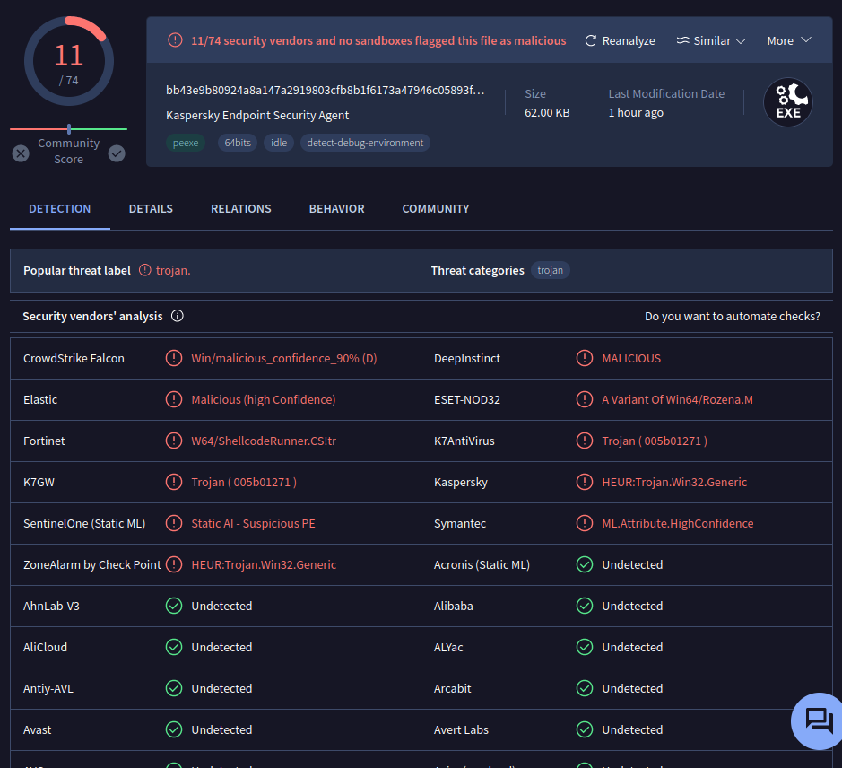

# RE Beginner Challenge I

Hello! During an incident response at one of our clients, an artifact was detected in a shared folder on the client's FileServer, a location where all users have access. We suspect that this artifact may be is used to communicating with the host identified as 'patient zero' (first host to be infected in the infrastructure).

However, when we done a initial triage in this artifact through its submission to VirusTotal, despite some vendors detecting it as malicious, we were unable to understand what this artifact does, and whether it belongs to any known malware family or infrastructure implant.

  

Therefore, we would like you to perform an in-depth analysis on this artifact, so that we can understand what it does, how it does it, and how we can automate the information detection and extraction process, through Yara rules and extractors written in Python (or any language you prefer).

Below is the *VirusTotal* link, and the sample link on *MalwareBazaar*.

[VirusTotal Link](https://www.virustotal.com/gui/file/bb43e9b80924a8a147a2919803cfb8b1f6173a47946c05893fee28a7c324cb37/details) - [MalwareBazaar Link](https://bazaar.abuse.ch/sample/bb43e9b80924a8a147a2919803cfb8b1f6173a47946c05893fee28a7c324cb37/)

